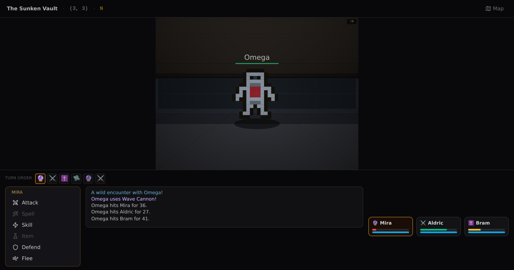
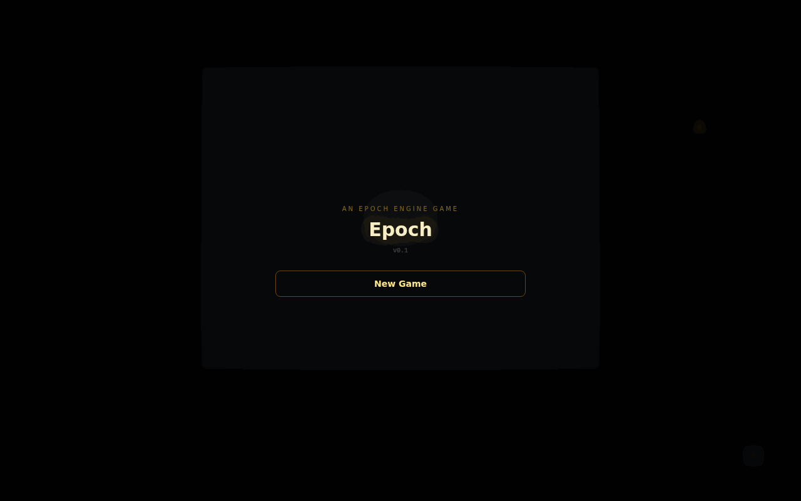

# Epoch

A free, open-source **first-person dungeon-crawler engine and authoring tool**
in the tradition of Eye of the Beholder, Shin Megami Tensei, and Wizardry —
approachable and free.

Draw grid maps, build a full ruleset (classes, spells, items, enemies, NPCs,
quests, events), and **play the result in a pseudo-3D first-person view** — with
turn-based combat, party management, exploration hazards, and a save system.
When your game is done, ship it as a **standalone app** (single double-click
HTML, hosted web build, or native desktop binary), or export a print-ready
**PDF** and a compact, self-describing **`.epochmap`** binary you can share with
other players.

<p align="center">
  
</p>

**See it in action** — a full playthrough exported to a single standalone HTML
file: start a new game, name your hero, talk to a quest-giver, loot a chest,
equip a full armor set from the in-game menu, then win a turn-based fight.

<p align="center">
  
</p>

This repository is **both**:

1. **A standalone web app** (Next.js) — open the editor in a browser tab, no
   login, no accounts, no server. State is file-based.
2. **The npm package `@northbridgetechnology/epoch-mapper`** — the editor
   component, the game engine, the PDF export pipeline, and the `.epochmap`
   codec.

> **Status:** the map editor, the `.epochmap` codec (now **v3** — a diffed
> ruleset makes a stock-content game well under 1 KB), and the custom-marker
> system are complete — and on top of that sits a full **game engine**: a
> first-person renderer, turn-based combat in three battle systems (classic /
> Persona-style 1-More / full SMT press-turn), a 15-table content database with
> richly seeded defaults, character progression, built-in music + SFX, a
> world-grid map system, events/quests/NPCs, and deep exploration systems.
> Finished games ship as **standalone apps** (single HTML, hosted web build, or
> native desktop) from a lean ~940 KB player. See the **Game engine** and
> **Distributing a finished game** sections below,
> [`docs/roadmap.md`](docs/roadmap.md) for deferred specs,
> [`docs/DISTRIBUTION.md`](docs/DISTRIBUTION.md) for packaging, and
> [`docs/sprites.md`](docs/sprites.md) for the sprite system.

---

## Game engine

Beyond the map editor, Epoch ships a playable first-person engine. Build
content in the **Database** and **Party** workspaces, place it on the grid with
the **Cell Inspector**, then switch to **Play** to walk your dungeon.

### First-person exploration

- **Pseudo-3D painter's renderer** (Eye of the Beholder / SMT style) with
  per-cell water/lava/void, ceiling/floor mortar grids, code-authored pixel
  sprites for objects and creatures (plus creator PNG uploads with two-frame
  animation), and real 3D stairs that descend into a pit or climb through a lit
  ceiling opening.
- **Light & darkness** — dark maps collapse view distance to the party's light
  radius; torches and lanterns shed light (with optional burn-down over steps),
  and light spells help too.
- **Trick tiles** — spinner, pit, silent teleport, anti-magic, darkness, safe
  room. Plus wall switches & switch-sealed doors, wall inscriptions, locked &
  keyed doors/chests, visible fixed encounters, and FOE-style patrols.
- **Step counter & status pressure** — Poison keeps ticking every few steps
  while exploring; Regeneration heals as you walk.
- **Minimap fog by exploration** — the auto-map is strictly the walked trail
  (Etrian/SMT breadcrumb style); the full-map view (`M`) shows only explored
  cells.
- **World grid & transitions** — stairs/doors and cross-map teleports present
  with a fade + destination name card (or a Wizardry-style confirm prompt);
  per-map **edge links** (N/S/E/W → neighbour) stitch maps into one open world,
  crossing seamlessly at the opposite edge with position preserved.
- **Camp/rest** with ambush risk, functional inns, save slots + save-point
  policy (save anywhere, or only on save points), and a wipe/game-over flow
  with gold penalty and respawn.

### Turn-based combat

- **Three battle systems**, a global Game Rule: **Classic** (one action per
  actor), **1-More** (Persona — weakness/crit grants an extra action), and
  **full SMT press-turn** (turn icons; weakness/crit spends half an icon, a
  miss burns two, knockdown, **All-Out Attack** when every foe is downed, and
  free member select).
- **FF-style command bar** — Attack / Skill / Spell / Item / Defend / Flee —
  over a 3×3 enemy playfield with front/back ranks on both sides.
- **Skills** — martial actives costing % of max HP, MP, or a round cooldown,
  gated by class learn tables, with a battle Skill submenu.
- **Empower-next mechanics** — Charge!/Focus Aim (next physical ×2) and
  Concentrate (next spell ×2). Boosts never stack and re-applying wastes the
  action — the log says so.
- **Elemental weaknesses & resistances** shape damage; status-effect modifiers
  shape hit math; spell schools scale power off their key attribute.
- **Charged equipment** — wands and staves can be zapped from the Item submenu
  (N⚡), spending charges that persist to the gear after battle.
- **Seeded, deterministic RNG** — same seed + same actions = same battle, which
  powers the built-in **balance simulator** for encounter tuning.
- Battle outcomes apply XP, level-ups, attribute growth, banked level points,
  newly learned spells/skills, loot, and gold in one pure resolution step.

### Enemies & bosses

- **Weighted, named ability kits** — each ability draws its substance from a
  **database spell**, a **database skill**, or custom inline effects, so
  monsters and player classes share one vocabulary (buff Bio once, every
  caster of Bio moves with it). The battle log speaks: "Malboro uses Bad
  Breath!"
- **Boss phases** — abilities can be gated behind HP thresholds ("below 35%
  own HP") or round numbers ("from round 3"); Bombs detonate when cornered,
  Behemoth starts calling Meteor.
- **Targeting AI** — random or hunt-the-weakest; in press modes enemies
  overweight weakness-hitting abilities and hunt physically-weak members.
- **Bestiary editor** — structured ability cards (weight with a live "% of
  turns" readout, enemy-perspective targets, phase gates, the shared effect
  builder) and per-element resistance sliders. **Duplicate** and **Make
  Elite** (×1.5 HP, ×1.25 ATK/DEF, ×2 rewards) turn any mob into a variant in
  one click.
- **Seeded bestiary** — 41 enemies across SMT-mythology and FF5–9 rosters
  (Jack Frost to Cactuar, Tonberry, Malboro, Behemoth, and the superboss
  Omega), each with a named kit, plus field/boss encounter tables.

### Character progression

- **Classes & races** with attribute modifiers, hit/spell dice, and
  proficiencies; a point-buy **Character Builder** for the protagonist.
- **FF-style equip restrictions** — weapon/armor **type tables** drive class
  proficiency, scaling attribute, damage element, range, armor speed penalty,
  and two-handed hand blocking.
- **Hybrid leveling** — classes auto-grow attributes per level *and* bank
  level points the player spends freely in the Tab menu (capped per
  attribute); an XP curve **formula override** (safe mini-evaluator) tunes
  pacing.
- **Spell learning** by school + level, plus single-use **spell tomes**
  (class school gates apply automatically); skills learn by class level.

### Content database

Fifteen tables, all with structured schema-driven editors (no raw JSON):
items, weapon types, armor types, music, classes, loot tables, bestiary,
encounter tables, spells, status effects, spell schools, skills, shops,
events, and quests — with **sortable, collapsible grouped lists** (spells by
school, statuses by kind, skills by class, items by kind/slot) built for
hundreds of entries.

Seeded defaults ship a playable baseline: **123 items** (iron→ebonsteel
material tiers, enchanted element weapons that drop unidentified, cursed
trap jewelry, artifacts, buff potions, thrown flasks, spell tomes, food, and
vendor treasure), **~60 spells** (full elemental lines plus dark and holy
damage schools, ailments, buffs, and the endgame quartet Holy / Flare /
Meteor / Ultima), **32 skills** (class actives plus the Blue-Magic monster
set: 1000 Needles, Bad Breath, Self-Destruct…), and loot tables that feed
the identify/curse economy.

### Music & audio

**16 built-in chiptune tracks** (synthesized on the fly — zero asset bytes) score
every slot out of the box; upload your own (baked into the `.epochmap`) or stream
by URL from the **Music database**. Gapless looping Web Audio, with a resolution
hierarchy: per-encounter custom music → boss → battle → per-map → game default.
The niceties are wired: a **victory fanfare**, a **boss-intro stinger** that
chains into the boss loop, **dialogue ducking**, and a **synthesized SFX kit**
(doors, chests, hits/crits, level-up, save…) on its own volume bus. Music and
sound volume/mute live in the in-game Config screen; a `playSound` effect lets
authored events fire SFX.

### Story systems

- **Cell events** (sequential chains, `onEnter`/`onInteract`/`onFlag`
  reactive) plus a global event library; **quests-as-flags** with a lore
  journal; From-Software-style **NPCs** (the player listens; NPCs speak) with
  dialogue-driven recruitment into the party.
- **Story & protagonist** — a paced **opening story** (slides with optional
  splash art), the player-built **Main Character** (name, portrait, pronoun,
  class/race, point-buy attributes), `{mc}`/pronoun text tokens resolved
  across all authored text, and an optional protagonist-death-ends-game rule.

### In-game menu (Tab)

An authentic FF-style full-screen hub — Item / Magic / Equip / Status /
Party / Journal / Camp / Save / Config — with complete keyboard control.
Notifications inside the menu are **front-and-center FF alert windows** (no
corner toasts). The Status screen is locked to player verbs while playing
(attributes rise only through the point-spend panel; designers keep full
god-mode editing in the workspaces), the hero can never be benched out of
the party, and Config carries music volume/mute and the control reference.

### Hazards

Traps spring their effects when stepped on, damage edges bite every crossing,
and event/boundary `damage`/`status`/`cure` effects resolve out of combat
(respecting race resistances; lethal, so a wipe rolls game-over).

### Generator

"Randomly Generate & Populate" builds a two-level demo world (main floor + a
dark *Depths*) wiring every system, in one of three layout styles: **Rooms**
(BSP), **EotB** (dense thin-wall maze), or **SMT** (arterial lattice). Every
generated door provably leads somewhere.

---

## Quick start

```bash
bun install          # or: npm install
bun run dev          # standalone editor at http://localhost:3100
```

### Scripts

| Script              | What it does                                            |
| ------------------- | ------------------------------------------------------- |
| `dev`               | Run the standalone app (Next.js, port 3100)             |
| `build`             | Production build of the standalone app (runs `build:player` first) |
| `build:lib`         | Bundle the npm package into `dist/` (JS + `.d.ts`)      |
| `build:player`      | Build the standalone-player template (esbuild + Tailwind) → `dist-player/` + `public/player-template.html` |
| `bake:game`         | Bake a `.epochmap` into a single standalone HTML (`bake:game <game.epochmap> [out.html]`) |
| `desktop:build`     | Build a native desktop app (Tauri) — see `docs/DISTRIBUTION.md` |
| `test`              | Full suite (200+ checks): codec, markers, combat, switches, events, generator, sprites, exploration, story, recruit, equipment, music, formula, spell-sort, bestiary, chiptune, world |
| `lint`              | ESLint                                                  |

Tests run via `tsx` (no DOM needed) — the codec, combat engine, event/effect
resolver, generator, and sprite library are all pure, so they work in the
browser, Node, and edge runtimes.

---

## Using the package

```ts
// Client entry — the React editor and everything it needs.
import {
  DungeonMapper,            // the full React editor component
  type DungeonMapperProps,
  exportMapsAsPdf,          // jsPDF export pipeline
  parseDotEpochmap,         // ArrayBuffer | Uint8Array -> EpochmapFile
  serializeDotEpochmap,     // EpochmapFile -> Uint8Array (gzipped)
  type EpochmapFile,
} from '@northbridgetechnology/epoch-mapper'

// Server entry — codec, marker helpers, type tables, and types only.
// No "use client" boundary, so it is safe to import in route handlers /
// server components (e.g. an .epochmap import API).
import { parseDotEpochmap, resolveMarkerImport, type EpochmapFile } from '@northbridgetechnology/epoch-mapper/server'
```

`DungeonMapper` is a client component (it uses React hooks). Import it from a
`'use client'` boundary in an RSC tree.

### Embedding (host-owned persistence)

By default the editor is file-based (localStorage draft + `.epochmap` files). A
host app can instead own persistence and seed/save the session:

```tsx
<DungeonMapper
  layout="fixed"                 // locked 12×12 grid for embeds; 'fill' = standalone
  initialSession={session}       // EpochmapFile loaded from your store
  onSessionChange={persist}      // debounced; you write it back (e.g. to a DB)
  welcomeOnFirstVisit={false}
/>
```

When `initialSession`/`onSessionChange` are provided the localStorage draft and
first-visit welcome are skipped — this is how a host app backs the editor with
its own database table instead of the file-based default.

---

## Distributing a finished game

A built game is self-contained (ruleset + maps + baked audio + sprites, all in
one `.epochmap`) and the engine is serverless client code, so a game ships as a
**standalone, editor-free player** three ways:

- **Single HTML file** — File → **Export Standalone HTML** (or
  `scripts/bake-game.mjs`) bakes the game into one double-click-to-play `.html`.
  Perfect for itch.io HTML5.
- **Hosted web build** — File → **Export Web Build (.zip)** downloads
  `index.html` + `game.epochmap` to unzip onto any static host or upload to
  itch.io (or `npm run build:player` for the folder).
- **Native desktop app** — a [Tauri](https://tauri.app) scaffold (`src-tauri/`)
  wraps the same build into a small Windows/macOS/Linux binary
  (`npm run desktop:build`).

All three come from one player build (`DungeonMapper distribution`, wrapped by
`<GamePlayer>`). Full walkthrough — including save-persistence and code-signing
caveats — in [`docs/DISTRIBUTION.md`](docs/DISTRIBUTION.md).

---

## The `.epochmap` format

A compact, gzip-compressed, self-describing binary. The header is **never
gzipped** so the magic bytes, version, game title, and ROM hash can be read
without decompressing.

```
[UNCOMPRESSED HEADER]                              (v3)
  4   magic         "EPKM"
  1   version       3
  2   gameTitleLen  (uint16 LE)
  N   gameTitle     UTF-8
  32  romHash       raw SHA-256 (32 bytes), all-zero if unknown

[GZIP-COMPRESSED BODY]
  custom markers · maps · cells · notes · revealed fog chunks
  · audio blobs (raw) · JSON extension block (ruleset diff + entities + meta)
```

All multi-byte integers are little-endian. Layout and built-in type ID tables
live in [`src/lib/epochmap-codec.ts`](src/lib/epochmap-codec.ts) and
[`src/lib/constants.ts`](src/lib/constants.ts); the ruleset diff is in
[`src/lib/ruleset-diff.ts`](src/lib/ruleset-diff.ts).

### Version history

- **v1** — visual only: markers, maps, cells (base + first overlay + legacy
  edge bits), notes, fog. Two design-reserved lossy spots: a cell may hold
  *multiple* overlays in the editor but v1 stores only the **first**, and edges
  collapse to a 4-bit "marked sides" mask + a **single** edge type.
- **v2** — adds a JSON extension block carrying the full L1 ruleset, per-cell
  entities, per-side boundaries, per-map meta, and baked audio (base64 inside
  the JSON). Boundaries move here, so the per-cell edge bytes go unused.
- **v3** — the same content, much smaller:
  - **Ruleset stored as a diff** against the built-in default ruleset (see
    `ruleset-diff.ts`). ~80% of every prior file was the byte-for-byte identical
    stock ruleset; the diff omits it and the loader reconstitutes it from the
    bundled defaults. A default-ruleset game dropped from **~30 KB to <1 KB**.
  - **Audio** rides a raw length-prefixed binary block (no base64 +33%, no
    double-compressing text-encoded bytes).
  - **romHash** packs to 32 raw bytes (was 64 hex ASCII).
  - The two always-zero per-cell edge bytes are **dropped**.

The codec reads v1, v2, and v3; it always writes v3. Round-trip fidelity
(including the v1 overlay/edge collapse and full v3 ruleset diff/patch) is
asserted in `test/codec.test.ts` and `test/ruleset-diff.test.ts`.

> **Self-containment tradeoff.** A v3 file leans on this build's default ruleset
> to fill the gaps it omits, so it's no longer 100% version-independent. Additive
> drift (a later release adding a stock spell) is benign; the defaults are
> otherwise treated as a stable base. Anything the author edited, added, removed,
> or reordered is stored in full and always wins.

---

## Custom markers

Open the **Marker Palette** (palette icon in the toolbar) to define your own cell
types and overlay icons. Each marker has a label (≤ 32 chars), a color, and an
icon (single emoji or ASCII character), and is assigned a stable ID in the
128–255 range. Custom markers appear in the sidebar palettes alongside the
built-ins and are embedded in every `.epochmap` export, so anyone who opens the
file sees your types correctly.

- **IDs** are monotonic within a session and never reused (deleting #130 then
  adding a new marker yields #131).
- **Deleting** a marker that's in use warns you and reverts those cells to Empty
  (base) or no-overlay (overlay).
- **Importing** a file resolves ID conflicts per spec §5.3: a free ID keeps its
  value, an identical definition is reused, and a clashing definition is
  reassigned to the next free ID with the affected imported cells remapped. This
  logic is exported (`resolveMarkerImport`, `remapMapMarkers`) for reuse in a
  host app's server-side import route.

---

## Standalone persistence

No server. Everything is file-based:

- **Auto-save draft** — `localStorage.epochmapper.draft` holds a JSON snapshot of
  the current session, debounced 500 ms. Restored automatically on the next
  visit (with a non-blocking "Restored unsaved session" toast).
- **Permanent save** — File → Save downloads a `.epochmap` binary.
- **Open / Import** — file picker or drag-and-drop a `.epochmap` onto the window.

The Welcome modal is shown once (`localStorage.epochmapper.welcomed`) and can be
re-opened any time with the **?** toolbar button or the `?` key.

---

## Keyboard shortcuts

| Key                  | Action                                  |
| -------------------- | --------------------------------------- |
| Arrow keys / WASD    | Move player marker                      |
| `F`                  | Toggle fog-of-war reveal for the chunk  |
| `N`                  | Add / edit a note on the current cell   |
| `Z` / `Ctrl+Z`       | Undo last cell edit                     |
| `Ctrl+S`             | Save session to `.epochmap`             |
| `Ctrl+P`             | Export PDF                              |
| `+` / `-`            | Zoom in / out                           |
| `?`                  | Open the help modal                     |

In **Play** mode:

| Key                  | Action                                  |
| -------------------- | --------------------------------------- |
| WASD / arrows        | Move / turn                             |
| `E`                  | Interact (doors, chests, NPCs, levers)  |
| `Tab`                | Open / close the in-game menu           |
| `M`                  | Toggle the full map view                |
| ↑/↓ · Enter · Esc    | Navigate menus / confirm / back         |

---

## Stack & deviations from the spec

Next.js (App Router) · TypeScript · Tailwind CSS. The spec names "Next.js 14";
this repo uses **Next 15 / React 19 / Tailwind 3**. gzip is provided by
[`fflate`](https://github.com/101arrowz/fflate) (browser + Node).

---

## Publishing (GitHub Packages)

The package is published to **GitHub Packages** as
`@northbridgetechnology/epoch-mapper` (the scope must match the org, which is why
it isn't `@epoch/*`).

**Automated (recommended):** bump `version` in `package.json`, then create a
GitHub Release. The [`publish` workflow](.github/workflows/publish.yml) builds
`dist/` and publishes using the built-in `GITHUB_TOKEN` — no secrets to set up.
You can also run it manually from the Actions tab.

**Manual (from a machine with a PAT that has `write:packages`):**

```bash
npm run build:lib
echo "//npm.pkg.github.com/:_authToken=YOUR_GITHUB_PAT" >> ~/.npmrc
npm publish        # publishConfig already targets npm.pkg.github.com
```

Consumers authenticate to the same registry for `@northbridgetechnology` — see
your `.npmrc`.

---

## Support the project ☕

Epoch is free and open source — no accounts, no ads, no paywalls. If it
has saved you time or you simply appreciate the work, you can show your support
by [**buying me a coffee**](https://www.buymeacoffee.com/northbridgetechnology).
Every cup helps keep the project maintained and is genuinely appreciated. The
app also has a coffee button in the bottom-right corner. Thank you!

---

## License

MIT — see [`LICENSE`](LICENSE).
